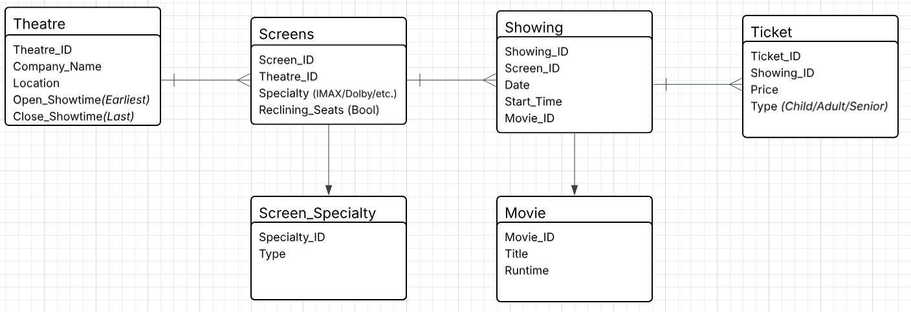
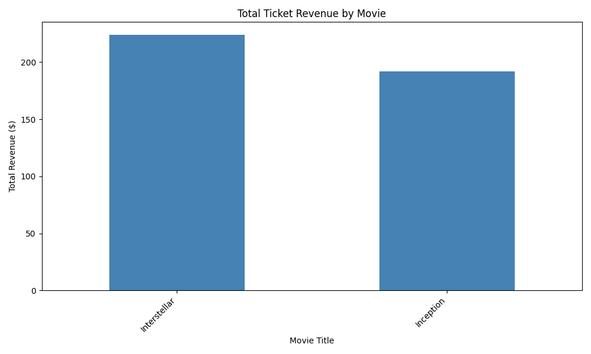
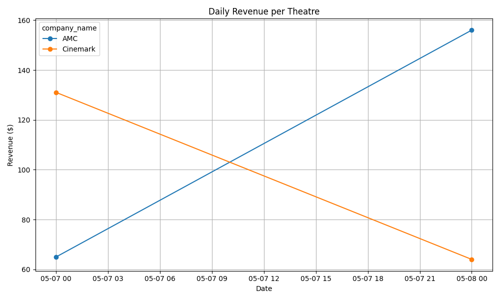

# Deliverables Overview
- Data and schema files can be found in the `db` folder. Explanation down below.
- The two solutions for the program can be found in the `python` and `cpp` folders respectively. Instructions on running the code can be found below, but note that the scripts are intended for MacOS but can easily be changed to Linux compatibility by using `apt install` instead of `brew install`
- The extension I chose was to analyze and plot the data to continue the context of "analyze the movie industry." The plots produced can be seen below.

# Notes and Assumptions:
- Used simple serial ints for IDs instead of UUIDs to save time. Would otherwise use UUIDs for scalability, portability, and security
  reasons.
- Would in theory add more data fields to the `movies` table and related tables, stopped at this count of fields for the sake of time.
- The overarching theme and perspective in this database structure was to be able to *provide finer micro and macroeconomic data in the future.*
    - Thought process was to be able to get box office information separated by both location and specific movie theatre parent company independently

# Architecture Explained:
The schema diagram is as follows: (db_schemas.sql in root dir)

The base concept behind this architecture was to provide the ability to look closer at trends specific to a movie theatre, and then zoom out from there to generate data and trends on a given region or timeframe, as well as temporal trends agnostic to geographical data. The microscopic view of just a theatre and its respective data would help in generating data that could be used in improving the sales at a single specific theatre, and the macroscopic view would aide in providing overall box office performance data.

# Data Location
The data used for the test database can be found in the `test_data.sql` file in the root directory.

# Instructions for Testing:
1. The following instructions assume you are on a ~~Unix based system. (i.e. MacOS or Ubuntu)~~ Mac. On top of that, I'm also assuming python and other core deps are installed on your machine. (The setup script does not account for all required installs)
2. Run `./setup.bash`
  - might require `sudo chmod +x setup.bash`
  - script installs python and cpp dependencies as well as PSQL
3. Open a new terminal and run the user input programs
  - Python Version:
    - run `python ./python/test_user_query.py`
  - CPP Version:
    - Enter the program directory using `cd cpp` then call `./run.bash`
    - Program should run automatically after compiling

# Extension
The plots below analyze the revenue by movie and the revenue per theatre over time. These plots aren't all too impressive given the lack of data, but the intent can easily be seen.

